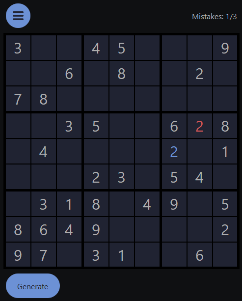

# Sudoku

## Description

This is a Sudoku generator, solver and mini-game written in C++ and with a friendly GUI developed with Qt Framework. It has 4 levels of difficulty and save/upload functionality for a more flexible game experience.

## Installation

- Download the release from the [Releases section](https://github.com/tiutcristian/Sudoku/releases/) and enjoy the Sudoku experience.

## Gameplay 

When opening the app, an empty board will be displayed and you have 2 options:

- Generate a board from the generate menu, which pops out when clicking the Generate button on the bottom of the page as follows:

- Load a partially solved board, saved to a file previously by clicking the load button in the top menu:

The top menu also includes options for saving the current board to a file, resetting the game, quitting and accessing the help page.
